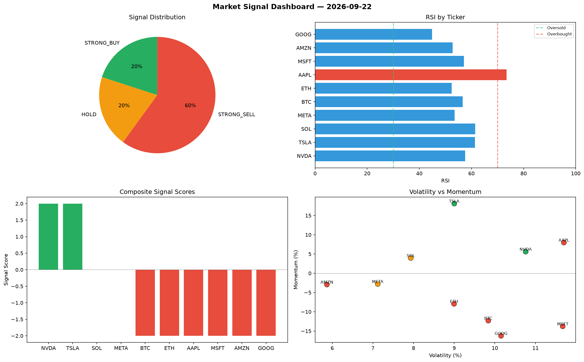

# Market Signal Report — 2026-09-22

**Run ID:** `e628aa70c7` | **Buy:** 2 | **Sell:** 6 | **Hold:** 2

## Signal Dashboard

| Ticker | Price | Signal | Score | RSI | Momentum | Confidence |
|--------|-------|--------|-------|-----|----------|------------|
| NVDA | $1197.92 | **STRONG_BUY** | 2 | 57.6 | 0.0561 | 0.5 |
| TSLA | $1132.06 | **STRONG_BUY** | 2 | 61.36 | 0.1809 | 0.5 |
| SOL | $2962.25 | **HOLD** | 0 | 61.39 | 0.0396 | 0.0 |
| META | $2247.84 | **HOLD** | 0 | 53.51 | -0.0279 | 0.0 |
| BTC | $2989.13 | **STRONG_SELL** | -2 | 56.63 | -0.1231 | 0.5 |
| ETH | $4352.79 | **STRONG_SELL** | -2 | 52.36 | -0.0794 | 0.5 |
| AAPL | $2011.08 | **STRONG_SELL** | -2 | 73.51 | 0.0797 | 0.5 |
| MSFT | $2071.03 | **STRONG_SELL** | -2 | 57.11 | -0.1378 | 0.5 |
| AMZN | $473.69 | **STRONG_SELL** | -2 | 52.75 | -0.0293 | 0.5 |
| GOOG | $1610.88 | **STRONG_SELL** | -2 | 44.9 | -0.1625 | 0.5 |

## Delta vs Yesterday

| Ticker | Today | Yesterday | Price Change | Signal Changed |
|--------|-------|-----------|-------------|----------------|
| NVDA | STRONG_BUY | STRONG_SELL | 📈 188.57% | ⚠️ YES |
| TSLA | STRONG_BUY | STRONG_BUY | 📈 35.95% | — |
| SOL | HOLD | STRONG_BUY | 📉 -20.8% | ⚠️ YES |
| META | HOLD | HOLD | 📉 -46.91% | — |
| BTC | STRONG_SELL | HOLD | 📈 19.74% | ⚠️ YES |
| ETH | STRONG_SELL | STRONG_SELL | 📈 364.98% | — |
| AAPL | STRONG_SELL | STRONG_SELL | 📈 55.91% | — |
| MSFT | STRONG_SELL | HOLD | 📉 -8.48% | ⚠️ YES |
| AMZN | STRONG_SELL | HOLD | 📉 -86.7% | ⚠️ YES |
| GOOG | STRONG_SELL | STRONG_SELL | 📉 -26.62% | — |