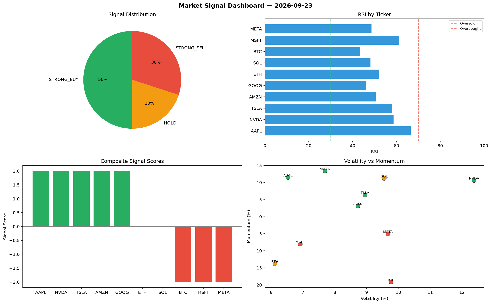

# Market Signal Report — 2026-09-23

**Run ID:** `0525fc710e` | **Buy:** 5 | **Sell:** 3 | **Hold:** 2

## Signal Dashboard

| Ticker | Price | Signal | Score | RSI | Momentum | Confidence |
|--------|-------|--------|-------|-----|----------|------------|
| AAPL | $3021.15 | **STRONG_BUY** | 2 | 66.55 | 0.1145 | 0.5 |
| NVDA | $4558.17 | **STRONG_BUY** | 2 | 58.73 | 0.1063 | 0.5 |
| TSLA | $2061.77 | **STRONG_BUY** | 2 | 57.97 | 0.064 | 0.5 |
| AMZN | $2679.95 | **STRONG_BUY** | 2 | 50.57 | 0.1338 | 0.5 |
| GOOG | $2644.29 | **STRONG_BUY** | 2 | 46.12 | 0.0313 | 0.5 |
| ETH | $3259.23 | **HOLD** | 0 | 52.05 | -0.1378 | 0.0 |
| SOL | $3771.25 | **HOLD** | 0 | 48.18 | 0.1123 | 0.0 |
| BTC | $3190.43 | **STRONG_SELL** | -2 | 43.34 | -0.1916 | 0.5 |
| MSFT | $2212.37 | **STRONG_SELL** | -2 | 61.36 | -0.0806 | 0.5 |
| META | $781.22 | **STRONG_SELL** | -2 | 48.62 | -0.0503 | 0.5 |

## Delta vs Yesterday

| Ticker | Today | Yesterday | Price Change | Signal Changed |
|--------|-------|-----------|-------------|----------------|
| AAPL | STRONG_BUY | STRONG_SELL | 📉 -28.22% | ⚠️ YES |
| NVDA | STRONG_BUY | STRONG_BUY | 📈 147.51% | — |
| TSLA | STRONG_BUY | BUY | 📉 -44.69% | ⚠️ YES |
| AMZN | STRONG_BUY | STRONG_SELL | 📈 21.56% | ⚠️ YES |
| GOOG | STRONG_BUY | STRONG_SELL | 📉 -12.8% | ⚠️ YES |
| ETH | HOLD | STRONG_SELL | 📉 -28.83% | ⚠️ YES |
| SOL | HOLD | BUY | 📈 374.74% | ⚠️ YES |
| BTC | STRONG_SELL | STRONG_BUY | 📉 -39.79% | ⚠️ YES |
| MSFT | STRONG_SELL | STRONG_BUY | 📈 177.51% | ⚠️ YES |
| META | STRONG_SELL | STRONG_BUY | 📈 196.49% | ⚠️ YES |