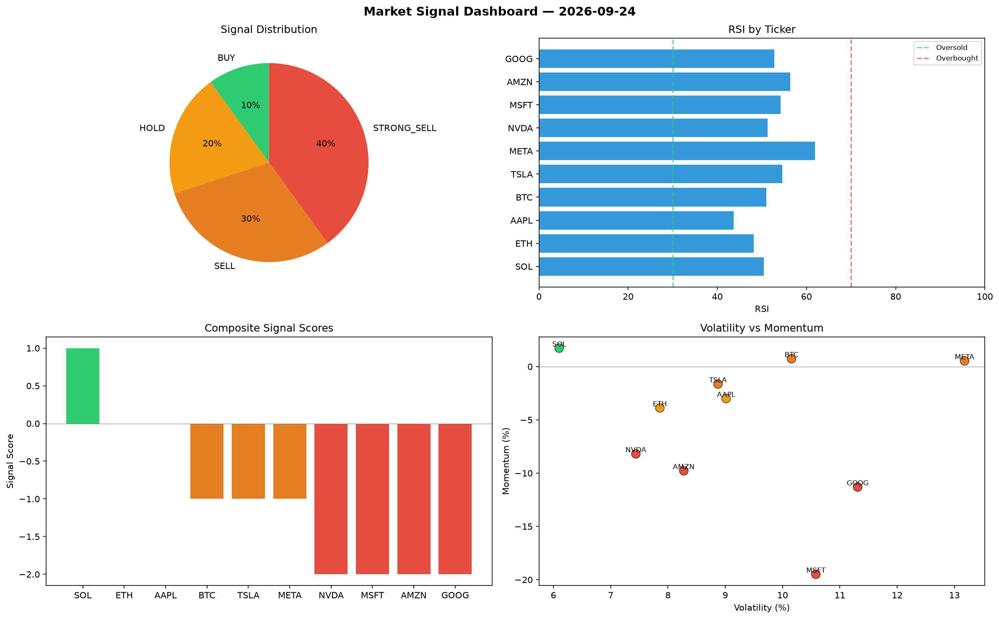

# Market Signal Report — 2026-09-24

**Run ID:** `149844b200` | **Buy:** 1 | **Sell:** 7 | **Hold:** 2

## Signal Dashboard

| Ticker | Price | Signal | Score | RSI | Momentum | Confidence |
|--------|-------|--------|-------|-----|----------|------------|
| SOL | $2268.52 | **BUY** | 1 | 50.39 | 0.0173 | 0.25 |
| ETH | $4338.17 | **HOLD** | 0 | 48.13 | -0.0388 | 0.0 |
| AAPL | $3964.57 | **HOLD** | 0 | 43.7 | -0.03 | 0.0 |
| BTC | $3604.83 | **SELL** | -1 | 51.03 | 0.0074 | 0.25 |
| TSLA | $205.92 | **SELL** | -1 | 54.57 | -0.0164 | 0.25 |
| META | $438.0 | **SELL** | -1 | 61.93 | 0.0053 | 0.25 |
| NVDA | $2848.0 | **STRONG_SELL** | -2 | 51.25 | -0.0819 | 0.5 |
| MSFT | $4550.47 | **STRONG_SELL** | -2 | 54.16 | -0.1949 | 0.5 |
| AMZN | $1190.46 | **STRONG_SELL** | -2 | 56.35 | -0.0978 | 0.5 |
| GOOG | $1979.45 | **STRONG_SELL** | -2 | 52.78 | -0.113 | 0.5 |

## Delta vs Yesterday

| Ticker | Today | Yesterday | Price Change | Signal Changed |
|--------|-------|-----------|-------------|----------------|
| SOL | BUY | HOLD | 📉 -39.85% | ⚠️ YES |
| ETH | HOLD | HOLD | 📈 33.1% | — |
| AAPL | HOLD | STRONG_BUY | 📈 31.23% | ⚠️ YES |
| BTC | SELL | STRONG_SELL | 📈 12.99% | ⚠️ YES |
| TSLA | SELL | STRONG_BUY | 📉 -90.01% | ⚠️ YES |
| META | SELL | STRONG_SELL | 📉 -43.93% | ⚠️ YES |
| NVDA | STRONG_SELL | STRONG_BUY | 📉 -37.52% | ⚠️ YES |
| MSFT | STRONG_SELL | STRONG_SELL | 📈 105.68% | — |
| AMZN | STRONG_SELL | STRONG_BUY | 📉 -55.58% | ⚠️ YES |
| GOOG | STRONG_SELL | STRONG_BUY | 📉 -25.14% | ⚠️ YES |