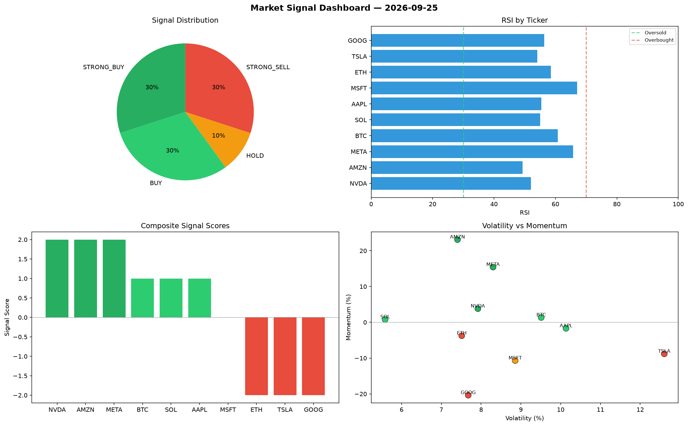

# Market Signal Report — 2026-09-25

**Run ID:** `10ea4512a4` | **Buy:** 6 | **Sell:** 3 | **Hold:** 1

## Signal Dashboard

| Ticker | Price | Signal | Score | RSI | Momentum | Confidence |
|--------|-------|--------|-------|-----|----------|------------|
| NVDA | $920.2 | **STRONG_BUY** | 2 | 52.05 | 0.0381 | 0.5 |
| AMZN | $160.83 | **STRONG_BUY** | 2 | 49.29 | 0.2311 | 0.5 |
| META | $1306.78 | **STRONG_BUY** | 2 | 65.78 | 0.1543 | 0.5 |
| BTC | $2217.36 | **BUY** | 1 | 60.79 | 0.0134 | 0.25 |
| SOL | $64.65 | **BUY** | 1 | 55.02 | 0.0081 | 0.25 |
| AAPL | $1070.9 | **BUY** | 1 | 55.41 | -0.0169 | 0.25 |
| MSFT | $4847.88 | **HOLD** | 0 | 67.04 | -0.107 | 0.0 |
| ETH | $3721.61 | **STRONG_SELL** | -2 | 58.55 | -0.0375 | 0.5 |
| TSLA | $1715.4 | **STRONG_SELL** | -2 | 54.12 | -0.0881 | 0.5 |
| GOOG | $3240.32 | **STRONG_SELL** | -2 | 56.39 | -0.2037 | 0.5 |

## Delta vs Yesterday

| Ticker | Today | Yesterday | Price Change | Signal Changed |
|--------|-------|-----------|-------------|----------------|
| NVDA | STRONG_BUY | STRONG_SELL | 📉 -67.69% | ⚠️ YES |
| AMZN | STRONG_BUY | STRONG_SELL | 📉 -86.49% | ⚠️ YES |
| META | STRONG_BUY | SELL | 📈 198.35% | ⚠️ YES |
| BTC | BUY | SELL | 📉 -38.49% | ⚠️ YES |
| SOL | BUY | BUY | 📉 -97.15% | — |
| AAPL | BUY | HOLD | 📉 -72.99% | ⚠️ YES |
| MSFT | HOLD | STRONG_SELL | 📈 6.54% | ⚠️ YES |
| ETH | STRONG_SELL | HOLD | 📉 -14.21% | ⚠️ YES |
| TSLA | STRONG_SELL | SELL | 📈 733.04% | ⚠️ YES |
| GOOG | STRONG_SELL | STRONG_SELL | 📈 63.7% | — |