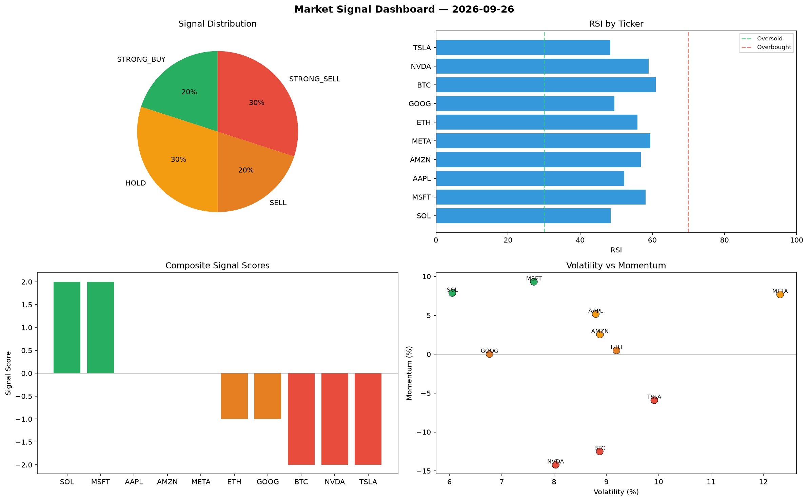

# Market Signal Report — 2026-09-26

**Run ID:** `db94ee07f1` | **Buy:** 2 | **Sell:** 5 | **Hold:** 3

## Signal Dashboard

| Ticker | Price | Signal | Score | RSI | Momentum | Confidence |
|--------|-------|--------|-------|-----|----------|------------|
| SOL | $544.53 | **STRONG_BUY** | 2 | 48.42 | 0.0787 | 0.5 |
| MSFT | $4833.14 | **STRONG_BUY** | 2 | 58.14 | 0.0931 | 0.5 |
| AAPL | $234.91 | **HOLD** | 0 | 52.21 | 0.0516 | 0.0 |
| AMZN | $3529.02 | **HOLD** | 0 | 56.79 | 0.0253 | 0.0 |
| META | $2889.01 | **HOLD** | 0 | 59.45 | 0.0768 | 0.0 |
| ETH | $2478.2 | **SELL** | -1 | 55.85 | 0.0049 | 0.25 |
| GOOG | $1398.05 | **SELL** | -1 | 49.47 | 0.0002 | 0.25 |
| BTC | $3616.69 | **STRONG_SELL** | -2 | 60.99 | -0.125 | 0.5 |
| NVDA | $2894.04 | **STRONG_SELL** | -2 | 58.97 | -0.1422 | 0.5 |
| TSLA | $4127.25 | **STRONG_SELL** | -2 | 48.41 | -0.0591 | 0.5 |

## Delta vs Yesterday

| Ticker | Today | Yesterday | Price Change | Signal Changed |
|--------|-------|-----------|-------------|----------------|
| SOL | STRONG_BUY | HOLD | 📉 -74.12% | ⚠️ YES |
| MSFT | STRONG_BUY | STRONG_SELL | 📈 86.96% | ⚠️ YES |
| AAPL | HOLD | HOLD | 📉 -93.59% | — |
| AMZN | HOLD | HOLD | 📉 -27.23% | — |
| META | HOLD | STRONG_BUY | 📉 -33.66% | ⚠️ YES |
| ETH | SELL | STRONG_SELL | 📈 26.33% | ⚠️ YES |
| GOOG | SELL | HOLD | 📈 3932.45% | ⚠️ YES |
| BTC | STRONG_SELL | STRONG_BUY | 📈 207.82% | ⚠️ YES |
| NVDA | STRONG_SELL | STRONG_BUY | 📈 778.69% | ⚠️ YES |
| TSLA | STRONG_SELL | SELL | 📈 1167.27% | ⚠️ YES |