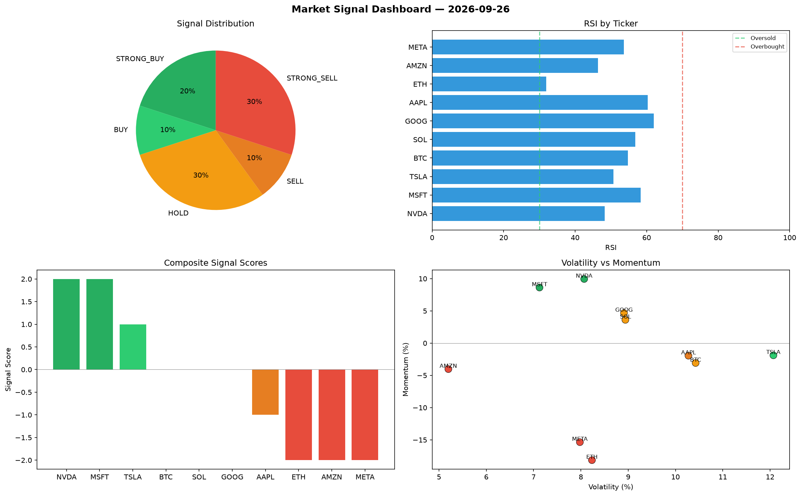

# Market Signal Report — 2026-09-26

**Run ID:** `643ff4d437` | **Buy:** 3 | **Sell:** 4 | **Hold:** 3

## Signal Dashboard

| Ticker | Price | Signal | Score | RSI | Momentum | Confidence |
|--------|-------|--------|-------|-----|----------|------------|
| NVDA | $1065.64 | **STRONG_BUY** | 2 | 48.23 | 0.0995 | 0.5 |
| MSFT | $2010.35 | **STRONG_BUY** | 2 | 58.32 | 0.0862 | 0.5 |
| TSLA | $544.86 | **BUY** | 1 | 50.69 | -0.0189 | 0.25 |
| BTC | $1062.62 | **HOLD** | 0 | 54.76 | -0.0308 | 0.0 |
| SOL | $920.29 | **HOLD** | 0 | 56.8 | 0.0361 | 0.0 |
| GOOG | $4871.95 | **HOLD** | 0 | 61.96 | 0.0467 | 0.0 |
| AAPL | $1154.23 | **SELL** | -1 | 60.27 | -0.0195 | 0.25 |
| ETH | $3404.5 | **STRONG_SELL** | -2 | 31.95 | -0.1815 | 0.5 |
| AMZN | $1748.05 | **STRONG_SELL** | -2 | 46.35 | -0.0403 | 0.5 |
| META | $1575.14 | **STRONG_SELL** | -2 | 53.61 | -0.1536 | 0.5 |

## Delta vs Yesterday

| Ticker | Today | Yesterday | Price Change | Signal Changed |
|--------|-------|-----------|-------------|----------------|
| NVDA | STRONG_BUY | STRONG_BUY | 📈 223.55% | — |
| MSFT | STRONG_BUY | STRONG_SELL | 📉 -22.23% | ⚠️ YES |
| TSLA | BUY | SELL | 📈 67.3% | ⚠️ YES |
| BTC | HOLD | STRONG_BUY | 📉 -9.56% | ⚠️ YES |
| SOL | HOLD | HOLD | 📉 -56.25% | — |
| GOOG | HOLD | HOLD | 📈 13952.35% | — |
| AAPL | SELL | HOLD | 📉 -68.5% | ⚠️ YES |
| ETH | STRONG_SELL | STRONG_SELL | 📈 73.55% | — |
| AMZN | STRONG_SELL | HOLD | 📉 -63.95% | ⚠️ YES |
| META | STRONG_SELL | STRONG_BUY | 📉 -63.83% | ⚠️ YES |