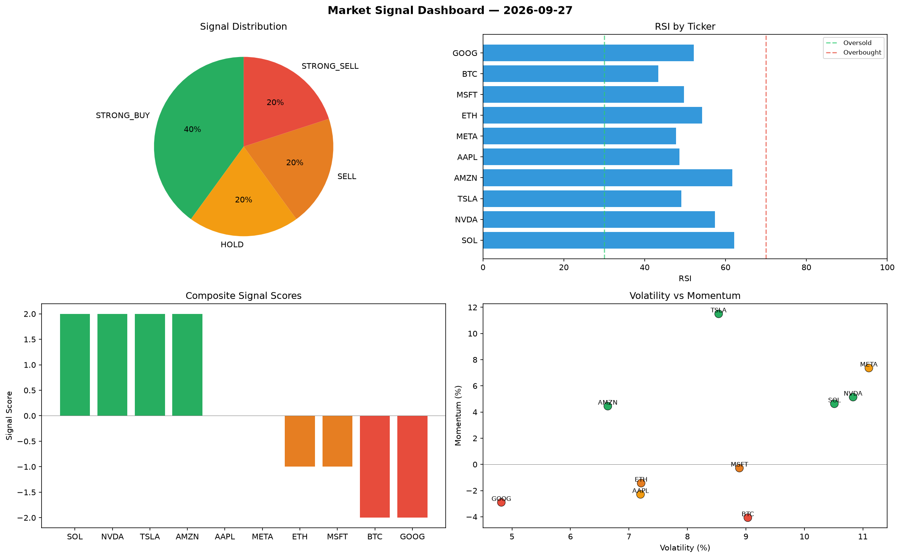

# Market Signal Report — 2026-09-27

**Run ID:** `cb3a646ac8` | **Buy:** 4 | **Sell:** 4 | **Hold:** 2

## Signal Dashboard

| Ticker | Price | Signal | Score | RSI | Momentum | Confidence |
|--------|-------|--------|-------|-----|----------|------------|
| SOL | $2996.5 | **STRONG_BUY** | 2 | 62.17 | 0.0463 | 0.5 |
| NVDA | $3466.26 | **STRONG_BUY** | 2 | 57.35 | 0.0514 | 0.5 |
| TSLA | $285.53 | **STRONG_BUY** | 2 | 49.04 | 0.115 | 0.5 |
| AMZN | $4649.39 | **STRONG_BUY** | 2 | 61.7 | 0.0445 | 0.5 |
| AAPL | $3161.17 | **HOLD** | 0 | 48.63 | -0.0229 | 0.0 |
| META | $3453.56 | **HOLD** | 0 | 47.77 | 0.0736 | 0.0 |
| ETH | $2639.07 | **SELL** | -1 | 54.17 | -0.0143 | 0.25 |
| MSFT | $1419.4 | **SELL** | -1 | 49.76 | -0.0028 | 0.25 |
| BTC | $1347.56 | **STRONG_SELL** | -2 | 43.32 | -0.0407 | 0.5 |
| GOOG | $2782.66 | **STRONG_SELL** | -2 | 52.12 | -0.029 | 0.5 |

## Delta vs Yesterday

| Ticker | Today | Yesterday | Price Change | Signal Changed |
|--------|-------|-----------|-------------|----------------|
| SOL | STRONG_BUY | HOLD | 📈 225.6% | ⚠️ YES |
| NVDA | STRONG_BUY | STRONG_BUY | 📈 225.27% | — |
| TSLA | STRONG_BUY | BUY | 📉 -47.6% | ⚠️ YES |
| AMZN | STRONG_BUY | STRONG_SELL | 📈 165.98% | ⚠️ YES |
| AAPL | HOLD | SELL | 📈 173.88% | ⚠️ YES |
| META | HOLD | STRONG_SELL | 📈 119.25% | ⚠️ YES |
| ETH | SELL | STRONG_SELL | 📉 -22.48% | ⚠️ YES |
| MSFT | SELL | STRONG_BUY | 📉 -29.4% | ⚠️ YES |
| BTC | STRONG_SELL | HOLD | 📈 26.81% | ⚠️ YES |
| GOOG | STRONG_SELL | HOLD | 📉 -42.88% | ⚠️ YES |