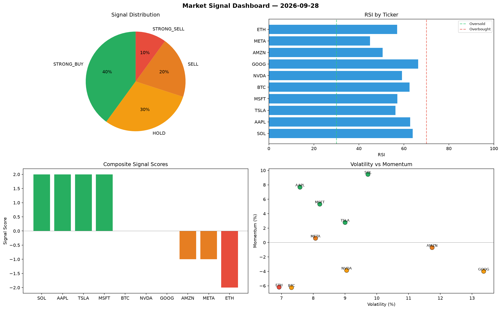

# Market Signal Report — 2026-09-28

**Run ID:** `55eaa4b465` | **Buy:** 4 | **Sell:** 3 | **Hold:** 3

## Signal Dashboard

| Ticker | Price | Signal | Score | RSI | Momentum | Confidence |
|--------|-------|--------|-------|-----|----------|------------|
| SOL | $3443.56 | **STRONG_BUY** | 2 | 63.91 | 0.0945 | 0.5 |
| AAPL | $2213.98 | **STRONG_BUY** | 2 | 62.78 | 0.0767 | 0.5 |
| TSLA | $2152.55 | **STRONG_BUY** | 2 | 56.23 | 0.0278 | 0.5 |
| MSFT | $4433.26 | **STRONG_BUY** | 2 | 57.14 | 0.0532 | 0.5 |
| BTC | $2363.28 | **HOLD** | 0 | 62.55 | -0.0625 | 0.0 |
| NVDA | $978.56 | **HOLD** | 0 | 59.18 | -0.0386 | 0.0 |
| GOOG | $3705.45 | **HOLD** | 0 | 66.37 | -0.0399 | 0.0 |
| AMZN | $3050.29 | **SELL** | -1 | 50.6 | -0.007 | 0.25 |
| META | $3341.28 | **SELL** | -1 | 44.92 | 0.0059 | 0.25 |
| ETH | $2150.11 | **STRONG_SELL** | -2 | 56.98 | -0.0619 | 0.5 |

## Delta vs Yesterday

| Ticker | Today | Yesterday | Price Change | Signal Changed |
|--------|-------|-----------|-------------|----------------|
| SOL | STRONG_BUY | SELL | 📈 57.15% | ⚠️ YES |
| AAPL | STRONG_BUY | STRONG_BUY | 📉 -57.92% | — |
| TSLA | STRONG_BUY | STRONG_BUY | 📈 181.59% | — |
| MSFT | STRONG_BUY | STRONG_SELL | 📈 5.12% | ⚠️ YES |
| BTC | HOLD | STRONG_BUY | 📉 -23.55% | ⚠️ YES |
| NVDA | HOLD | STRONG_SELL | 📉 -40.77% | ⚠️ YES |
| GOOG | HOLD | HOLD | 📈 112.33% | — |
| AMZN | SELL | STRONG_SELL | 📈 8.44% | ⚠️ YES |
| META | SELL | SELL | 📈 24.82% | — |
| ETH | STRONG_SELL | BUY | 📈 16.59% | ⚠️ YES |