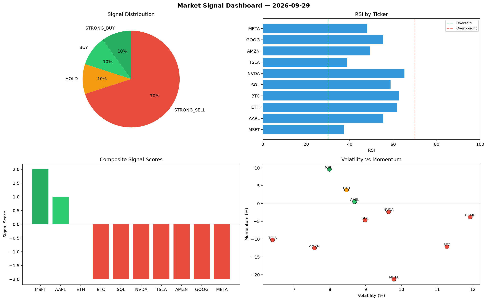

# Market Signal Report — 2026-09-29

**Run ID:** `bca7a48b56` | **Buy:** 2 | **Sell:** 7 | **Hold:** 1

## Signal Dashboard

| Ticker | Price | Signal | Score | RSI | Momentum | Confidence |
|--------|-------|--------|-------|-----|----------|------------|
| MSFT | $3428.11 | **STRONG_BUY** | 2 | 37.4 | 0.0961 | 0.5 |
| AAPL | $763.62 | **BUY** | 1 | 55.5 | 0.0055 | 0.25 |
| ETH | $878.72 | **HOLD** | 0 | 61.93 | 0.0378 | 0.0 |
| BTC | $4230.26 | **STRONG_SELL** | -2 | 62.65 | -0.1212 | 0.5 |
| SOL | $715.09 | **STRONG_SELL** | -2 | 58.82 | -0.0468 | 0.5 |
| NVDA | $3184.59 | **STRONG_SELL** | -2 | 65.2 | -0.023 | 0.5 |
| TSLA | $2846.35 | **STRONG_SELL** | -2 | 38.8 | -0.1019 | 0.5 |
| AMZN | $944.06 | **STRONG_SELL** | -2 | 49.3 | -0.1248 | 0.5 |
| GOOG | $545.11 | **STRONG_SELL** | -2 | 55.45 | -0.0378 | 0.5 |
| META | $792.8 | **STRONG_SELL** | -2 | 48.07 | -0.2126 | 0.5 |

## Delta vs Yesterday

| Ticker | Today | Yesterday | Price Change | Signal Changed |
|--------|-------|-----------|-------------|----------------|
| MSFT | STRONG_BUY | HOLD | 📈 48.64% | ⚠️ YES |
| AAPL | BUY | HOLD | 📉 -54.53% | ⚠️ YES |
| ETH | HOLD | BUY | 📉 -76.14% | ⚠️ YES |
| BTC | STRONG_SELL | STRONG_BUY | 📈 251.94% | ⚠️ YES |
| SOL | STRONG_SELL | STRONG_SELL | 📈 360.25% | — |
| NVDA | STRONG_SELL | STRONG_SELL | 📈 119.78% | — |
| TSLA | STRONG_SELL | HOLD | 📈 95.7% | ⚠️ YES |
| AMZN | STRONG_SELL | STRONG_BUY | 📉 -56.21% | ⚠️ YES |
| GOOG | STRONG_SELL | STRONG_BUY | 📉 -88.64% | ⚠️ YES |
| META | STRONG_SELL | BUY | 📉 -80.61% | ⚠️ YES |