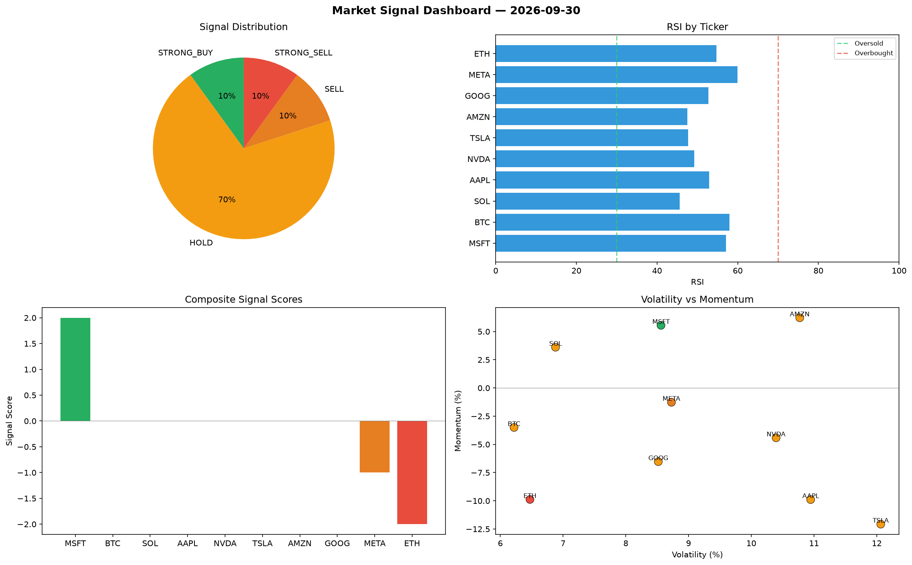

# Market Signal Report — 2026-09-30

**Run ID:** `78b77b7d00` | **Buy:** 1 | **Sell:** 2 | **Hold:** 7

## Signal Dashboard

| Ticker | Price | Signal | Score | RSI | Momentum | Confidence |
|--------|-------|--------|-------|-----|----------|------------|
| MSFT | $4882.74 | **STRONG_BUY** | 2 | 57.06 | 0.0555 | 0.5 |
| BTC | $2974.99 | **HOLD** | 0 | 57.93 | -0.035 | 0.0 |
| SOL | $3574.13 | **HOLD** | 0 | 45.59 | 0.0361 | 0.0 |
| AAPL | $3559.08 | **HOLD** | 0 | 52.9 | -0.0989 | 0.0 |
| NVDA | $4132.54 | **HOLD** | 0 | 49.25 | -0.0442 | 0.0 |
| TSLA | $866.88 | **HOLD** | 0 | 47.72 | -0.1207 | 0.0 |
| AMZN | $4465.68 | **HOLD** | 0 | 47.47 | 0.0622 | 0.0 |
| GOOG | $4622.38 | **HOLD** | 0 | 52.74 | -0.0653 | 0.0 |
| META | $1269.62 | **SELL** | -1 | 59.9 | -0.0127 | 0.25 |
| ETH | $636.56 | **STRONG_SELL** | -2 | 54.7 | -0.0988 | 0.5 |

## Delta vs Yesterday

| Ticker | Today | Yesterday | Price Change | Signal Changed |
|--------|-------|-----------|-------------|----------------|
| MSFT | STRONG_BUY | SELL | 📈 68.59% | ⚠️ YES |
| BTC | HOLD | STRONG_SELL | 📈 21.17% | ⚠️ YES |
| SOL | HOLD | STRONG_BUY | 📈 388.27% | ⚠️ YES |
| AAPL | HOLD | STRONG_SELL | 📈 125.34% | ⚠️ YES |
| NVDA | HOLD | STRONG_BUY | 📈 145.31% | ⚠️ YES |
| TSLA | HOLD | STRONG_SELL | 📉 -60.39% | ⚠️ YES |
| AMZN | HOLD | STRONG_BUY | 📈 10.06% | ⚠️ YES |
| GOOG | HOLD | BUY | 📈 45.66% | ⚠️ YES |
| META | SELL | BUY | 📉 -67.44% | ⚠️ YES |
| ETH | STRONG_SELL | STRONG_BUY | 📉 -75.8% | ⚠️ YES |