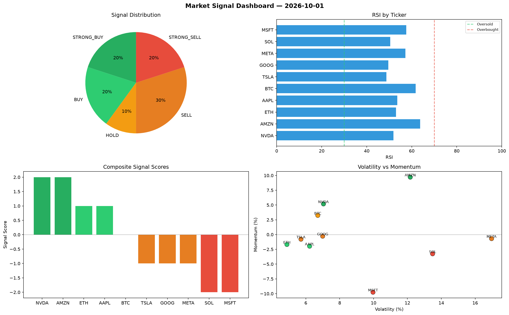

# Market Signal Report — 2026-10-01

**Run ID:** `4a9f6cfe65` | **Buy:** 4 | **Sell:** 5 | **Hold:** 1

## Signal Dashboard

| Ticker | Price | Signal | Score | RSI | Momentum | Confidence |
|--------|-------|--------|-------|-----|----------|------------|
| NVDA | $5002.78 | **STRONG_BUY** | 2 | 51.89 | 0.0518 | 0.5 |
| AMZN | $1622.9 | **STRONG_BUY** | 2 | 63.76 | 0.0971 | 0.5 |
| ETH | $896.86 | **BUY** | 1 | 53.02 | -0.0168 | 0.25 |
| AAPL | $4523.94 | **BUY** | 1 | 53.58 | -0.0197 | 0.25 |
| BTC | $3258.35 | **HOLD** | 0 | 61.73 | 0.0324 | 0.0 |
| TSLA | $1947.93 | **SELL** | -1 | 48.7 | -0.0079 | 0.25 |
| GOOG | $2013.47 | **SELL** | -1 | 49.57 | -0.0028 | 0.25 |
| META | $445.32 | **SELL** | -1 | 57.18 | -0.0069 | 0.25 |
| SOL | $3729.14 | **STRONG_SELL** | -2 | 50.45 | -0.0326 | 0.5 |
| MSFT | $1934.15 | **STRONG_SELL** | -2 | 57.58 | -0.0976 | 0.5 |

## Delta vs Yesterday

| Ticker | Today | Yesterday | Price Change | Signal Changed |
|--------|-------|-----------|-------------|----------------|
| NVDA | STRONG_BUY | HOLD | 📈 1930.51% | ⚠️ YES |
| AMZN | STRONG_BUY | STRONG_BUY | 📉 -68.67% | — |
| ETH | BUY | STRONG_SELL | 📉 -78.85% | ⚠️ YES |
| AAPL | BUY | HOLD | 📈 95.4% | ⚠️ YES |
| BTC | HOLD | STRONG_BUY | 📉 -31.61% | ⚠️ YES |
| TSLA | SELL | BUY | 📉 -46.64% | ⚠️ YES |
| GOOG | SELL | STRONG_SELL | 📉 -35.42% | ⚠️ YES |
| META | SELL | STRONG_BUY | 📉 -90.96% | ⚠️ YES |
| SOL | STRONG_SELL | STRONG_SELL | 📈 30.25% | — |
| MSFT | STRONG_SELL | STRONG_SELL | 📉 -53.4% | — |