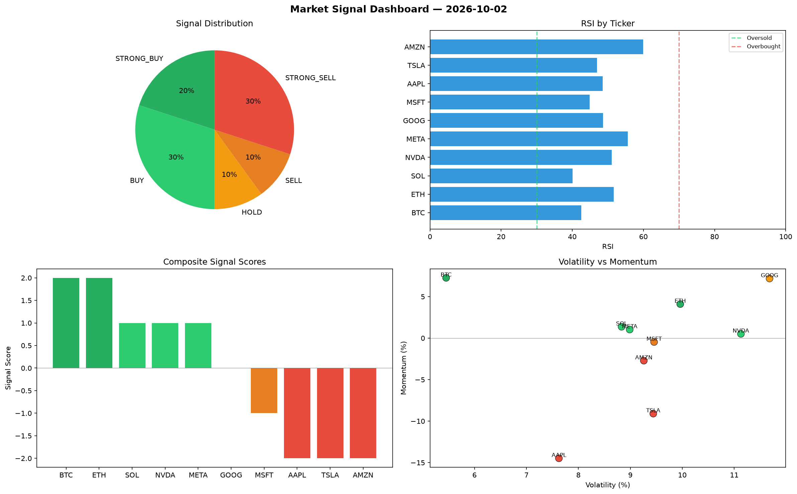

# Market Signal Report — 2026-10-02

**Run ID:** `df49987881` | **Buy:** 5 | **Sell:** 4 | **Hold:** 1

## Signal Dashboard

| Ticker | Price | Signal | Score | RSI | Momentum | Confidence |
|--------|-------|--------|-------|-----|----------|------------|
| BTC | $677.07 | **STRONG_BUY** | 2 | 42.5 | 0.0726 | 0.5 |
| ETH | $3870.9 | **STRONG_BUY** | 2 | 51.61 | 0.041 | 0.5 |
| SOL | $4119.88 | **BUY** | 1 | 40.05 | 0.0137 | 0.25 |
| NVDA | $4412.65 | **BUY** | 1 | 51.07 | 0.0051 | 0.25 |
| META | $4714.45 | **BUY** | 1 | 55.57 | 0.0103 | 0.25 |
| GOOG | $2824.23 | **HOLD** | 0 | 48.68 | 0.0718 | 0.0 |
| MSFT | $516.18 | **SELL** | -1 | 44.88 | -0.0047 | 0.25 |
| AAPL | $1543.16 | **STRONG_SELL** | -2 | 48.53 | -0.1448 | 0.5 |
| TSLA | $1092.64 | **STRONG_SELL** | -2 | 46.99 | -0.091 | 0.5 |
| AMZN | $2217.17 | **STRONG_SELL** | -2 | 59.96 | -0.0272 | 0.5 |

## Delta vs Yesterday

| Ticker | Today | Yesterday | Price Change | Signal Changed |
|--------|-------|-----------|-------------|----------------|
| BTC | STRONG_BUY | HOLD | 📉 -79.22% | ⚠️ YES |
| ETH | STRONG_BUY | BUY | 📈 331.61% | ⚠️ YES |
| SOL | BUY | STRONG_SELL | 📈 10.48% | ⚠️ YES |
| NVDA | BUY | STRONG_BUY | 📉 -11.8% | ⚠️ YES |
| META | BUY | SELL | 📈 958.67% | ⚠️ YES |
| GOOG | HOLD | SELL | 📈 40.27% | ⚠️ YES |
| MSFT | SELL | STRONG_SELL | 📉 -73.31% | ⚠️ YES |
| AAPL | STRONG_SELL | BUY | 📉 -65.89% | ⚠️ YES |
| TSLA | STRONG_SELL | SELL | 📉 -43.91% | ⚠️ YES |
| AMZN | STRONG_SELL | STRONG_BUY | 📈 36.62% | ⚠️ YES |