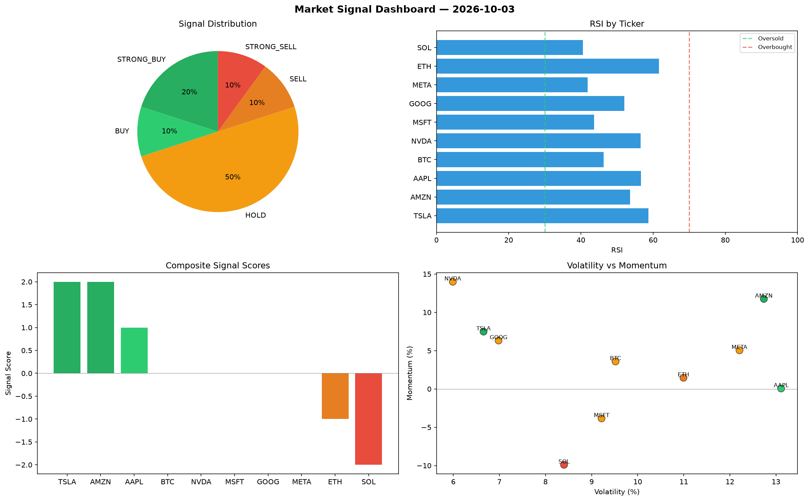

# Market Signal Report — 2026-10-03

**Run ID:** `31976cdce3` | **Buy:** 3 | **Sell:** 2 | **Hold:** 5

## Signal Dashboard

| Ticker | Price | Signal | Score | RSI | Momentum | Confidence |
|--------|-------|--------|-------|-----|----------|------------|
| TSLA | $345.37 | **STRONG_BUY** | 2 | 58.7 | 0.0748 | 0.5 |
| AMZN | $1396.17 | **STRONG_BUY** | 2 | 53.63 | 0.1175 | 0.5 |
| AAPL | $3025.0 | **BUY** | 1 | 56.64 | 0.0006 | 0.25 |
| BTC | $3416.03 | **HOLD** | 0 | 46.3 | 0.0359 | 0.0 |
| NVDA | $1815.49 | **HOLD** | 0 | 56.57 | 0.1399 | 0.0 |
| MSFT | $34.69 | **HOLD** | 0 | 43.67 | -0.0385 | 0.0 |
| GOOG | $3085.9 | **HOLD** | 0 | 52.05 | 0.0632 | 0.0 |
| META | $241.86 | **HOLD** | 0 | 41.86 | 0.0504 | 0.0 |
| ETH | $252.23 | **SELL** | -1 | 61.58 | 0.0146 | 0.25 |
| SOL | $1604.19 | **STRONG_SELL** | -2 | 40.56 | -0.099 | 0.5 |

## Delta vs Yesterday

| Ticker | Today | Yesterday | Price Change | Signal Changed |
|--------|-------|-----------|-------------|----------------|
| TSLA | STRONG_BUY | HOLD | 📉 -91.82% | ⚠️ YES |
| AMZN | STRONG_BUY | STRONG_BUY | 📈 126.27% | — |
| AAPL | BUY | STRONG_BUY | 📈 447.02% | ⚠️ YES |
| BTC | HOLD | STRONG_SELL | 📈 115.92% | ⚠️ YES |
| NVDA | HOLD | HOLD | 📉 -60.74% | — |
| MSFT | HOLD | BUY | 📉 -99.0% | ⚠️ YES |
| GOOG | HOLD | HOLD | 📉 -39.55% | — |
| META | HOLD | SELL | 📉 -94.03% | ⚠️ YES |
| ETH | SELL | HOLD | 📈 25.68% | ⚠️ YES |
| SOL | STRONG_SELL | STRONG_SELL | 📈 66.86% | — |