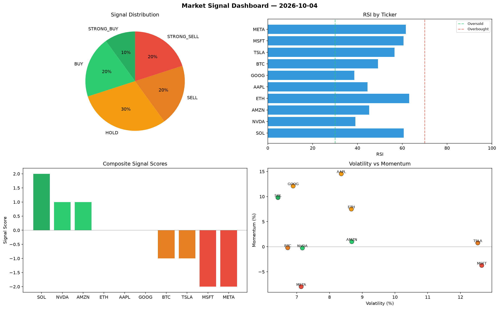

# Market Signal Report — 2026-10-04

**Run ID:** `f6a951bedc` | **Buy:** 3 | **Sell:** 4 | **Hold:** 3

## Signal Dashboard

| Ticker | Price | Signal | Score | RSI | Momentum | Confidence |
|--------|-------|--------|-------|-----|----------|------------|
| SOL | $3059.66 | **STRONG_BUY** | 2 | 60.66 | 0.098 | 0.5 |
| NVDA | $1174.21 | **BUY** | 1 | 39.03 | -0.0025 | 0.25 |
| AMZN | $4565.53 | **BUY** | 1 | 45.2 | 0.0101 | 0.25 |
| ETH | $1784.81 | **HOLD** | 0 | 63.04 | 0.0751 | 0.0 |
| AAPL | $294.67 | **HOLD** | 0 | 44.47 | 0.1454 | 0.0 |
| GOOG | $4006.25 | **HOLD** | 0 | 38.58 | 0.1211 | 0.0 |
| BTC | $1679.86 | **SELL** | -1 | 49.19 | -0.0021 | 0.25 |
| TSLA | $2283.27 | **SELL** | -1 | 56.51 | 0.0076 | 0.25 |
| MSFT | $1971.5 | **STRONG_SELL** | -2 | 60.52 | -0.0373 | 0.5 |
| META | $886.93 | **STRONG_SELL** | -2 | 61.58 | -0.0797 | 0.5 |

## Delta vs Yesterday

| Ticker | Today | Yesterday | Price Change | Signal Changed |
|--------|-------|-----------|-------------|----------------|
| SOL | STRONG_BUY | STRONG_SELL | 📈 120.44% | ⚠️ YES |
| NVDA | BUY | HOLD | 📉 -56.3% | ⚠️ YES |
| AMZN | BUY | STRONG_BUY | 📈 276.44% | ⚠️ YES |
| ETH | HOLD | BUY | 📉 -29.17% | ⚠️ YES |
| AAPL | HOLD | SELL | 📉 -89.79% | ⚠️ YES |
| GOOG | HOLD | HOLD | 📈 2.02% | — |
| BTC | SELL | HOLD | 📈 97.67% | ⚠️ YES |
| TSLA | SELL | STRONG_BUY | 📈 183.39% | ⚠️ YES |
| MSFT | STRONG_SELL | STRONG_SELL | 📉 -43.89% | — |
| META | STRONG_SELL | HOLD | 📉 -62.8% | ⚠️ YES |