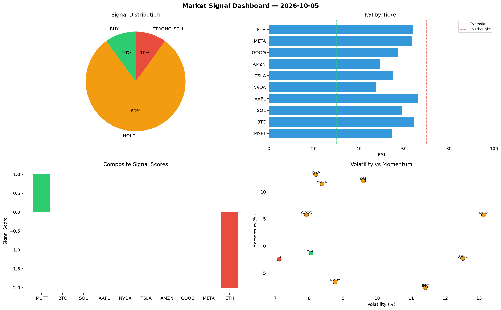

# Market Signal Report — 2026-10-05

**Run ID:** `9a66501e30` | **Buy:** 1 | **Sell:** 1 | **Hold:** 8

## Signal Dashboard

| Ticker | Price | Signal | Score | RSI | Momentum | Confidence |
|--------|-------|--------|-------|-----|----------|------------|
| MSFT | $2652.25 | **BUY** | 1 | 54.69 | -0.0133 | 0.25 |
| BTC | $975.99 | **HOLD** | 0 | 64.29 | -0.0769 | 0.0 |
| SOL | $1325.49 | **HOLD** | 0 | 59.16 | 0.1204 | 0.0 |
| AAPL | $853.23 | **HOLD** | 0 | 66.17 | -0.023 | 0.0 |
| NVDA | $585.73 | **HOLD** | 0 | 47.5 | -0.0665 | 0.0 |
| TSLA | $1479.97 | **HOLD** | 0 | 55.02 | 0.1322 | 0.0 |
| AMZN | $672.42 | **HOLD** | 0 | 49.38 | 0.1143 | 0.0 |
| GOOG | $1330.81 | **HOLD** | 0 | 57.27 | 0.0576 | 0.0 |
| META | $108.28 | **HOLD** | 0 | 63.77 | 0.0571 | 0.0 |
| ETH | $3744.39 | **STRONG_SELL** | -2 | 64.11 | -0.0243 | 0.5 |

## Delta vs Yesterday

| Ticker | Today | Yesterday | Price Change | Signal Changed |
|--------|-------|-----------|-------------|----------------|
| MSFT | BUY | STRONG_SELL | 📈 6695.41% | ⚠️ YES |
| BTC | HOLD | HOLD | 📉 -48.15% | — |
| SOL | HOLD | HOLD | 📉 -66.02% | — |
| AAPL | HOLD | STRONG_BUY | 📈 226.77% | ⚠️ YES |
| NVDA | HOLD | SELL | 📉 -76.72% | ⚠️ YES |
| TSLA | HOLD | STRONG_BUY | 📉 -25.85% | ⚠️ YES |
| AMZN | HOLD | STRONG_SELL | 📉 -70.27% | ⚠️ YES |
| GOOG | HOLD | STRONG_SELL | 📉 -10.13% | ⚠️ YES |
| META | HOLD | SELL | 📉 -5.81% | ⚠️ YES |
| ETH | STRONG_SELL | HOLD | 📈 103.59% | ⚠️ YES |