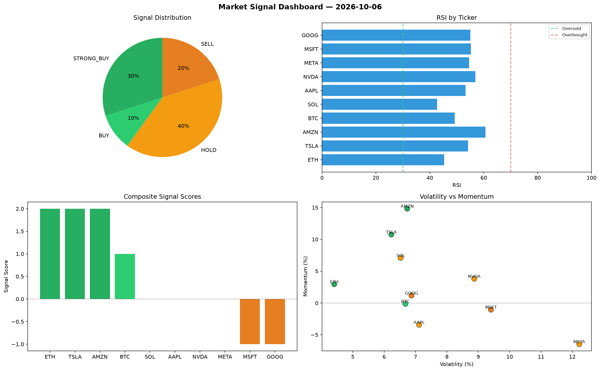

# Market Signal Report — 2026-10-06

**Run ID:** `e15ab254f6` | **Buy:** 4 | **Sell:** 2 | **Hold:** 4

## Signal Dashboard

| Ticker | Price | Signal | Score | RSI | Momentum | Confidence |
|--------|-------|--------|-------|-----|----------|------------|
| ETH | $3481.83 | **STRONG_BUY** | 2 | 45.29 | 0.0295 | 0.5 |
| TSLA | $4675.18 | **STRONG_BUY** | 2 | 54.21 | 0.1075 | 0.5 |
| AMZN | $1858.03 | **STRONG_BUY** | 2 | 60.63 | 0.1482 | 0.5 |
| BTC | $1393.2 | **BUY** | 1 | 49.23 | -0.0014 | 0.25 |
| SOL | $3945.51 | **HOLD** | 0 | 42.73 | 0.0708 | 0.0 |
| AAPL | $2084.96 | **HOLD** | 0 | 53.31 | -0.0343 | 0.0 |
| NVDA | $1982.73 | **HOLD** | 0 | 56.89 | 0.038 | 0.0 |
| META | $1358.04 | **HOLD** | 0 | 54.62 | -0.0647 | 0.0 |
| MSFT | $4892.64 | **SELL** | -1 | 55.24 | -0.0105 | 0.25 |
| GOOG | $2000.94 | **SELL** | -1 | 55.07 | 0.0117 | 0.25 |

## Delta vs Yesterday

| Ticker | Today | Yesterday | Price Change | Signal Changed |
|--------|-------|-----------|-------------|----------------|
| ETH | STRONG_BUY | STRONG_BUY | 📈 30.41% | — |
| TSLA | STRONG_BUY | HOLD | 📉 -6.18% | ⚠️ YES |
| AMZN | STRONG_BUY | HOLD | 📉 -51.48% | ⚠️ YES |
| BTC | BUY | HOLD | 📉 -68.95% | ⚠️ YES |
| SOL | HOLD | STRONG_BUY | 📈 2245.31% | ⚠️ YES |
| AAPL | HOLD | SELL | 📈 23.72% | ⚠️ YES |
| NVDA | HOLD | STRONG_SELL | 📉 -55.18% | ⚠️ YES |
| META | HOLD | STRONG_SELL | 📉 -58.52% | ⚠️ YES |
| MSFT | SELL | STRONG_BUY | 📈 805.37% | ⚠️ YES |
| GOOG | SELL | STRONG_SELL | 📉 -4.09% | ⚠️ YES |