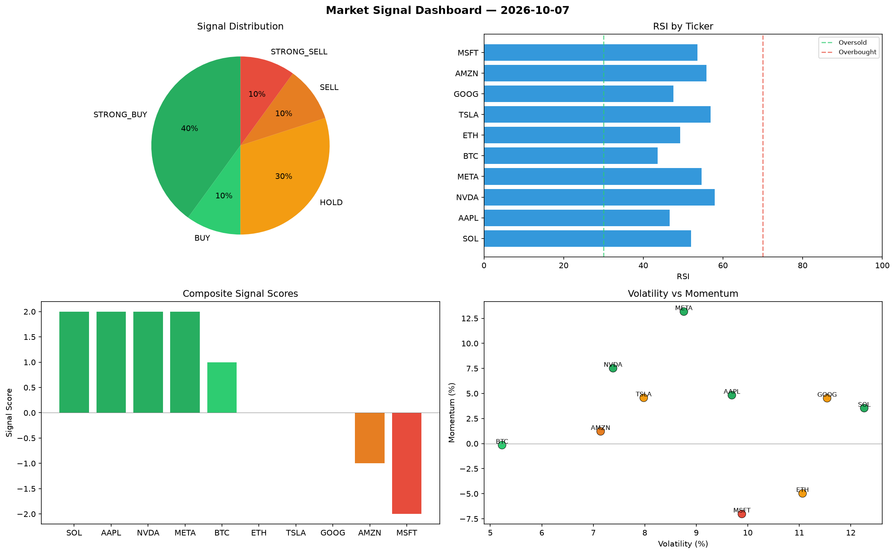

# Market Signal Report — 2026-10-07

**Run ID:** `7086a0b9ce` | **Buy:** 5 | **Sell:** 2 | **Hold:** 3

## Signal Dashboard

| Ticker | Price | Signal | Score | RSI | Momentum | Confidence |
|--------|-------|--------|-------|-----|----------|------------|
| SOL | $3670.69 | **STRONG_BUY** | 2 | 51.97 | 0.0354 | 0.5 |
| AAPL | $2533.76 | **STRONG_BUY** | 2 | 46.6 | 0.0483 | 0.5 |
| NVDA | $452.94 | **STRONG_BUY** | 2 | 57.91 | 0.0752 | 0.5 |
| META | $5124.66 | **STRONG_BUY** | 2 | 54.63 | 0.1317 | 0.5 |
| BTC | $2201.56 | **BUY** | 1 | 43.56 | -0.0015 | 0.25 |
| ETH | $2015.59 | **HOLD** | 0 | 49.28 | -0.0497 | 0.0 |
| TSLA | $2565.49 | **HOLD** | 0 | 56.92 | 0.0457 | 0.0 |
| GOOG | $3321.24 | **HOLD** | 0 | 47.56 | 0.0453 | 0.0 |
| AMZN | $2140.22 | **SELL** | -1 | 55.85 | 0.0122 | 0.25 |
| MSFT | $1954.27 | **STRONG_SELL** | -2 | 53.56 | -0.0702 | 0.5 |

## Delta vs Yesterday

| Ticker | Today | Yesterday | Price Change | Signal Changed |
|--------|-------|-----------|-------------|----------------|
| SOL | STRONG_BUY | HOLD | 📈 99.25% | ⚠️ YES |
| AAPL | STRONG_BUY | STRONG_BUY | 📉 -36.46% | — |
| NVDA | STRONG_BUY | HOLD | 📉 -87.0% | ⚠️ YES |
| META | STRONG_BUY | STRONG_SELL | 📈 19.63% | ⚠️ YES |
| BTC | BUY | SELL | 📉 -45.21% | ⚠️ YES |
| ETH | HOLD | SELL | 📉 -57.24% | ⚠️ YES |
| TSLA | HOLD | HOLD | 📉 -25.49% | — |
| GOOG | HOLD | HOLD | 📈 2347.49% | — |
| AMZN | SELL | HOLD | 📉 -48.95% | ⚠️ YES |
| MSFT | STRONG_SELL | STRONG_SELL | 📈 155.18% | — |