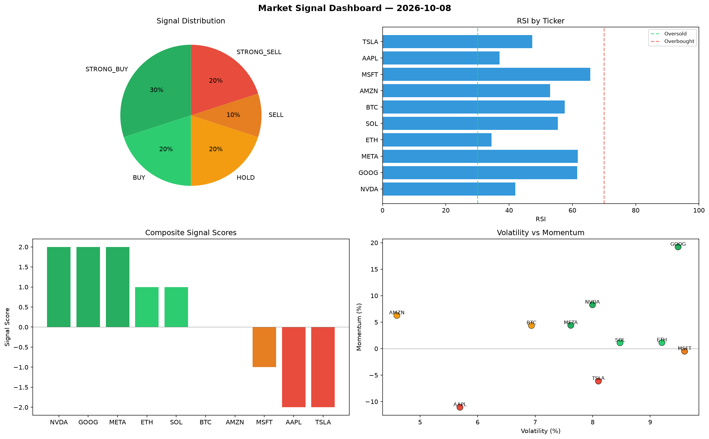

# Market Signal Report — 2026-10-08

**Run ID:** `d5915e8432` | **Buy:** 5 | **Sell:** 3 | **Hold:** 2

## Signal Dashboard

| Ticker | Price | Signal | Score | RSI | Momentum | Confidence |
|--------|-------|--------|-------|-----|----------|------------|
| NVDA | $1671.2 | **STRONG_BUY** | 2 | 42.01 | 0.0828 | 0.5 |
| GOOG | $179.52 | **STRONG_BUY** | 2 | 61.5 | 0.1921 | 0.5 |
| META | $47.26 | **STRONG_BUY** | 2 | 61.69 | 0.044 | 0.5 |
| ETH | $191.28 | **BUY** | 1 | 34.45 | 0.0114 | 0.25 |
| SOL | $1554.58 | **BUY** | 1 | 55.44 | 0.011 | 0.25 |
| BTC | $851.52 | **HOLD** | 0 | 57.56 | 0.0437 | 0.0 |
| AMZN | $2053.17 | **HOLD** | 0 | 53.01 | 0.0627 | 0.0 |
| MSFT | $3527.57 | **SELL** | -1 | 65.67 | -0.0049 | 0.25 |
| AAPL | $572.7 | **STRONG_SELL** | -2 | 37.03 | -0.1107 | 0.5 |
| TSLA | $464.48 | **STRONG_SELL** | -2 | 47.31 | -0.0613 | 0.5 |

## Delta vs Yesterday

| Ticker | Today | Yesterday | Price Change | Signal Changed |
|--------|-------|-----------|-------------|----------------|
| NVDA | STRONG_BUY | STRONG_BUY | 📈 161.53% | — |
| GOOG | STRONG_BUY | STRONG_BUY | 📉 -95.76% | — |
| META | STRONG_BUY | HOLD | 📉 -94.13% | ⚠️ YES |
| ETH | BUY | STRONG_BUY | 📈 345.87% | ⚠️ YES |
| SOL | BUY | STRONG_SELL | 📉 -61.43% | ⚠️ YES |
| BTC | HOLD | SELL | 📉 -81.91% | ⚠️ YES |
| AMZN | HOLD | STRONG_SELL | 📈 11.15% | ⚠️ YES |
| MSFT | SELL | SELL | 📈 31.47% | — |
| AAPL | STRONG_SELL | STRONG_BUY | 📉 -72.57% | ⚠️ YES |
| TSLA | STRONG_SELL | HOLD | 📉 -90.64% | ⚠️ YES |