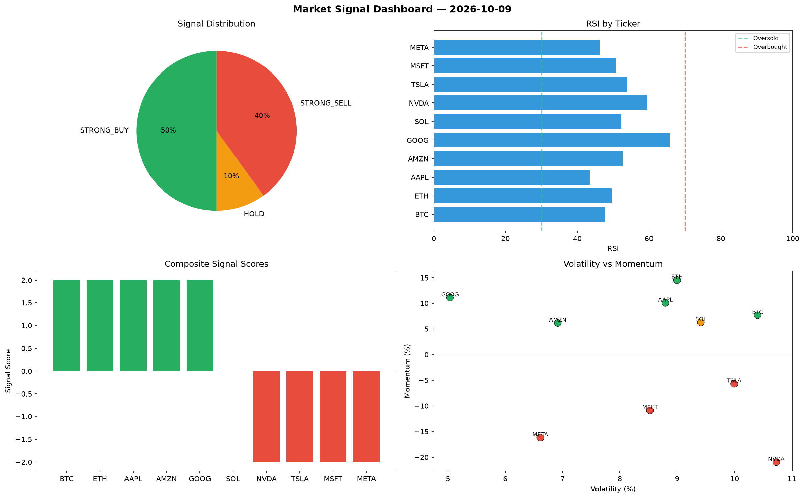

# Market Signal Report — 2026-10-09

**Run ID:** `c1298dfd6d` | **Buy:** 5 | **Sell:** 4 | **Hold:** 1

## Signal Dashboard

| Ticker | Price | Signal | Score | RSI | Momentum | Confidence |
|--------|-------|--------|-------|-----|----------|------------|
| BTC | $1409.7 | **STRONG_BUY** | 2 | 47.67 | 0.077 | 0.5 |
| ETH | $1516.34 | **STRONG_BUY** | 2 | 49.57 | 0.1453 | 0.5 |
| AAPL | $613.88 | **STRONG_BUY** | 2 | 43.43 | 0.1006 | 0.5 |
| AMZN | $2565.26 | **STRONG_BUY** | 2 | 52.73 | 0.0616 | 0.5 |
| GOOG | $4385.26 | **STRONG_BUY** | 2 | 65.88 | 0.1108 | 0.5 |
| SOL | $1931.81 | **HOLD** | 0 | 52.29 | 0.0628 | 0.0 |
| NVDA | $1241.43 | **STRONG_SELL** | -2 | 59.42 | -0.2096 | 0.5 |
| TSLA | $1834.98 | **STRONG_SELL** | -2 | 53.86 | -0.0571 | 0.5 |
| MSFT | $4208.26 | **STRONG_SELL** | -2 | 50.85 | -0.1089 | 0.5 |
| META | $476.73 | **STRONG_SELL** | -2 | 46.32 | -0.1621 | 0.5 |

## Delta vs Yesterday

| Ticker | Today | Yesterday | Price Change | Signal Changed |
|--------|-------|-----------|-------------|----------------|
| BTC | STRONG_BUY | STRONG_BUY | 📉 -69.49% | — |
| ETH | STRONG_BUY | STRONG_SELL | 📉 -25.02% | ⚠️ YES |
| AAPL | STRONG_BUY | STRONG_SELL | 📉 -85.85% | ⚠️ YES |
| AMZN | STRONG_BUY | SELL | 📉 -0.68% | ⚠️ YES |
| GOOG | STRONG_BUY | STRONG_SELL | 📉 -5.37% | ⚠️ YES |
| SOL | HOLD | STRONG_BUY | 📉 -26.38% | ⚠️ YES |
| NVDA | STRONG_SELL | STRONG_SELL | 📈 9807.66% | — |
| TSLA | STRONG_SELL | HOLD | 📈 102.65% | ⚠️ YES |
| MSFT | STRONG_SELL | SELL | 📈 41.3% | ⚠️ YES |
| META | STRONG_SELL | SELL | 📉 -66.13% | ⚠️ YES |