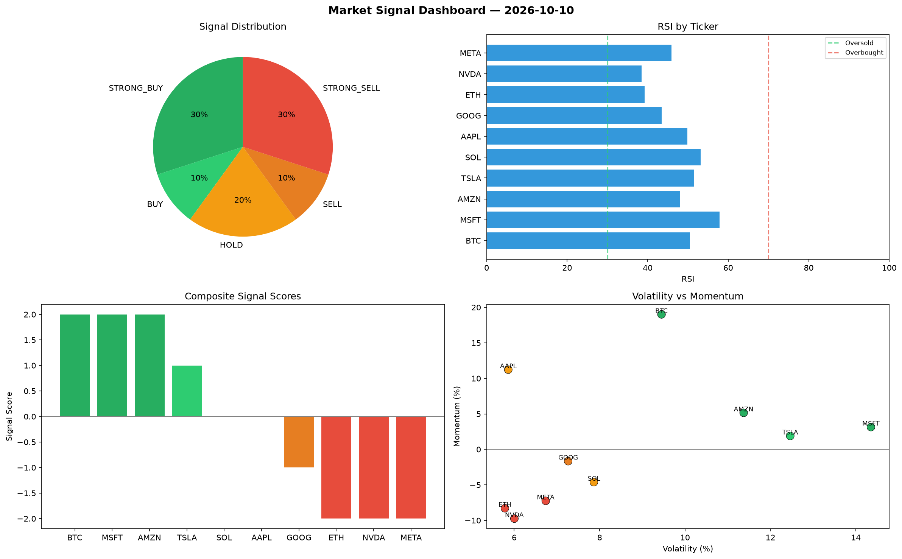

# Market Signal Report — 2026-10-10

**Run ID:** `f7a6d4ac05` | **Buy:** 4 | **Sell:** 4 | **Hold:** 2

## Signal Dashboard

| Ticker | Price | Signal | Score | RSI | Momentum | Confidence |
|--------|-------|--------|-------|-----|----------|------------|
| BTC | $5120.82 | **STRONG_BUY** | 2 | 50.53 | 0.1901 | 0.5 |
| MSFT | $1627.07 | **STRONG_BUY** | 2 | 57.88 | 0.0314 | 0.5 |
| AMZN | $2901.66 | **STRONG_BUY** | 2 | 48.12 | 0.0515 | 0.5 |
| TSLA | $1427.71 | **BUY** | 1 | 51.53 | 0.0189 | 0.25 |
| SOL | $680.74 | **HOLD** | 0 | 53.14 | -0.0462 | 0.0 |
| AAPL | $2719.14 | **HOLD** | 0 | 49.91 | 0.1123 | 0.0 |
| GOOG | $668.21 | **SELL** | -1 | 43.49 | -0.0166 | 0.25 |
| ETH | $2395.89 | **STRONG_SELL** | -2 | 39.23 | -0.0829 | 0.5 |
| NVDA | $4337.36 | **STRONG_SELL** | -2 | 38.52 | -0.0975 | 0.5 |
| META | $3408.61 | **STRONG_SELL** | -2 | 45.88 | -0.0725 | 0.5 |

## Delta vs Yesterday

| Ticker | Today | Yesterday | Price Change | Signal Changed |
|--------|-------|-----------|-------------|----------------|
| BTC | STRONG_BUY | STRONG_SELL | 📈 65.15% | ⚠️ YES |
| MSFT | STRONG_BUY | HOLD | 📈 610.39% | ⚠️ YES |
| AMZN | STRONG_BUY | HOLD | 📈 566.21% | ⚠️ YES |
| TSLA | BUY | STRONG_BUY | 📉 -38.16% | ⚠️ YES |
| SOL | HOLD | STRONG_BUY | 📉 -4.46% | ⚠️ YES |
| AAPL | HOLD | STRONG_BUY | 📉 -55.44% | ⚠️ YES |
| GOOG | SELL | STRONG_BUY | 📉 -81.79% | ⚠️ YES |
| ETH | STRONG_SELL | SELL | 📈 601.35% | ⚠️ YES |
| NVDA | STRONG_SELL | HOLD | 📈 63.91% | ⚠️ YES |
| META | STRONG_SELL | STRONG_BUY | 📈 1563.87% | ⚠️ YES |